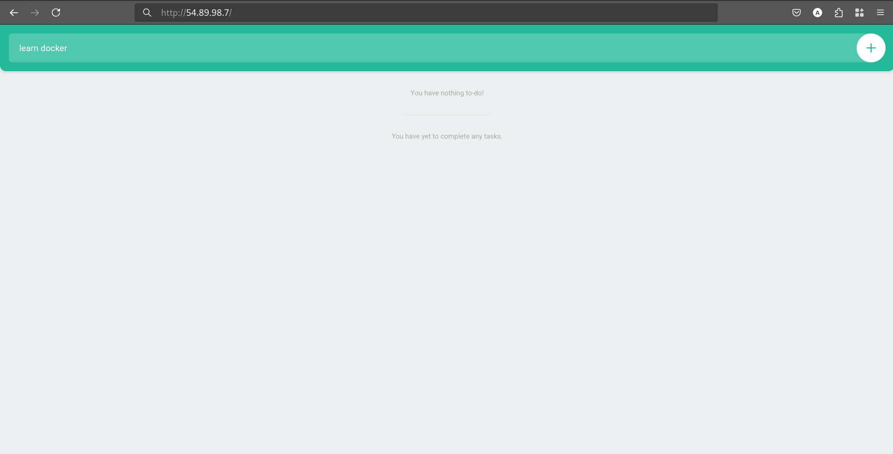

# 📝 Todo App Infrastructure

A full-stack Todo application deployed on **AWS** using **Terraform** for Infrastructure as Code (IaC), **Docker** for containerization, and **PostgreSQL on AWS RDS** for the database.

The application includes:
- A **Node.js backend**
- A **static HTML frontend served by NGINX**
- A **PostgreSQL database**, all orchestrated securely inside a VPC

---

## 🚀 Features

- **Frontend**: Static `index.html` served by **NGINX**, proxying API requests to the backend.
- **Backend**: Node.js app running on port `3000`, connected to **AWS RDS PostgreSQL**.
- **Infrastructure**:
  - Custom VPC with public/private subnets
  - EC2 instance (`t3.micro`)
  - RDS PostgreSQL 13.16
  - Elastic IP for stable EC2 access
- **Deployment**:
  - Fully automated using Terraform
  - EC2 `user_data` script sets up Docker, clones the repo, and runs `docker-compose.prod.yml`
- **Security**:
  - Security groups restrict access (port 80 open, port 22 restricted, port 5432 only from EC2)

---

## 🧱 Architecture

- **VPC**:
  - Public Subnet (`us-east-1a`) for EC2
  - Private Subnet (`us-east-1a`) for RDS
- **EC2**:
  - Runs Docker containers for NGINX and backend
- **RDS**:
  - PostgreSQL 13.16 with private access
- **Elastic IP**:
  - Public access to EC2
- **Security Groups**:
  - Port 80 (web), 3000 (backend), 5432 (RDS)

---

## ✅ Prerequisites

- AWS Account with permissions for EC2, RDS, and VPC
- AWS CLI configured (`aws configure`)
- Terraform v1.5 or higher
- Git
- EC2 Key Pair (e.g., `todo-app-key`)

---

## 📦 Deployment Instructions

### 1. Clone the Repository

```bash
git clone https://github.com/reehassan/02_todo_app_infra.git
cd 02_todo_app_infra
````

---

### 2. Create EC2 Key Pair

```bash
aws ec2 create-key-pair \
  --key-name todo-app-key \
  --query 'KeyMaterial' \
  --output text \
  --region us-east-1 > terraform/todo-app-key.pem

chmod 400 terraform/todo-app-key.pem
```

---

### 3. Set Database Password

Create `terraform/terraform.tfvars`:

```hcl
db_password = "TodoApp123!"
```

> ⚠️ Password must be printable ASCII (no `/`, `@`, `"`, or spaces), 8–41 characters.

---

### 4. Deploy with Terraform

```bash
cd terraform
terraform init
terraform apply
```

Review the plan and type `yes` to confirm.

---

### 5. Terraform Outputs

* `ec2_public_ip`: Public IP (e.g., `54.82.229.185`)
* `rds_endpoint`: RDS endpoint (e.g., `todo-app-db.xxxx.us-east-1.rds.amazonaws.com:5432`)
* `ssh_instructions`: SSH command (e.g., `ssh -i todo-app-key.pem ubuntu@54.82.229.185`)

---

## 🌐 Access the Application

Open in browser:

```
http://<ec2_public_ip>
```

---

## 🛠 SSH Access (Optional)

```bash
ssh -i terraform/todo-app-key.pem ubuntu@<ec2_public_ip>
```

Check running containers:

```bash
docker ps
```

Logs:

```bash
docker logs <nginx-container-id>
docker logs <backend-container-id>
```

---

## 🧩 Troubleshooting

### ❌ App Not Loading

* Verify SG allows port 80:

```bash
aws ec2 describe-security-groups \
  --filters "Name=tag:Name,Values=todo-app-ec2-sg" \
  --region us-east-1 \
  --query 'SecurityGroups[].IpPermissions[?FromPort==`80`]'
```

* Restart containers:

```bash
cd /home/ubuntu/02_todo_app_infra
docker-compose -f docker-compose.prod.yml --env-file .env.production up --build -d
```

* Test services:

```bash
curl http://localhost
curl http://localhost:3000
```

---

### ❌ RDS Not Responding

Test connectivity:

```bash
export PGPASSWORD="TodoApp123!"
psql -h <rds_endpoint> -p 5432 -U todouser -d todoapp -c "\dt"
```

Reapply schema if needed:

```bash
psql -h <rds_endpoint> -p 5432 -U todouser -d todoapp -f /home/ubuntu/02_todo_app_infra/database/init.sql
```

---

### ❌ SSH Issues

* Ensure `.pem` exists and has correct permissions:

```bash
chmod 400 terraform/todo-app-key.pem
```

* Open port 22 in SG if needed:

```hcl
ingress {
  from_port   = 22
  to_port     = 22
  protocol    = "tcp"
  cidr_blocks = ["<your-ip>/32"]
}
```

Find your IP:

```bash
curl ifconfig.me
```

---

### ❌ Docker Build Fails

Check logs:

```bash
docker-compose -f /home/ubuntu/02_todo_app_infra/docker-compose.prod.yml logs
```

Ensure the `Dockerfile.multi-stage` and paths in `backend/` are correct.

---

## 🧹 Clean Up

```bash
cd terraform
terraform destroy
```

Confirm with `yes` when prompted. Ensure EC2, RDS, EIP, and VPC are removed from AWS Console.

---

## 🖼 Screenshots

> 

---

## 🔧 Technologies Used

* **Terraform** – IaC for AWS provisioning
* **Docker / Docker Compose** – Containerization
* **AWS** – EC2, RDS, VPC, EIP
* **NGINX** – Static file server and reverse proxy
* **Node.js** – Backend API
* **PostgreSQL** – Database (RDS)

---

## 📄 License

This project is licensed under the **MIT License** – see [`LICENSE.md`](LICENSE.md) for details.
